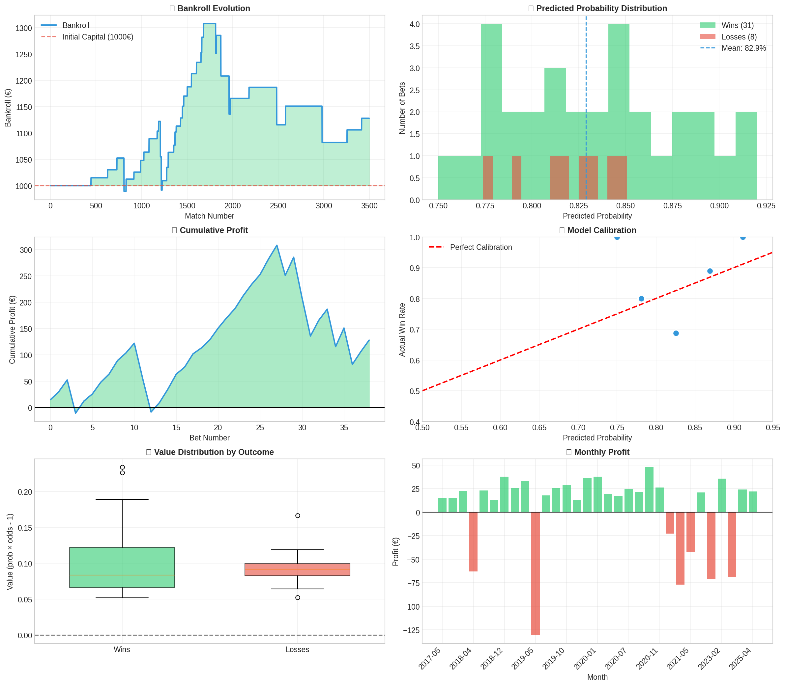
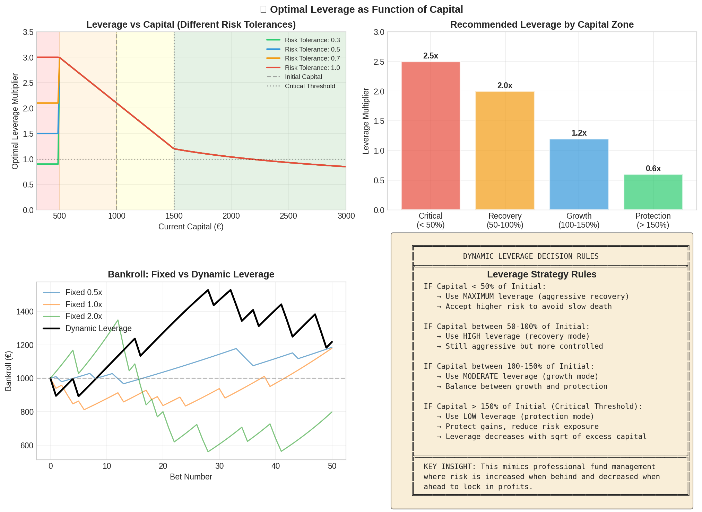
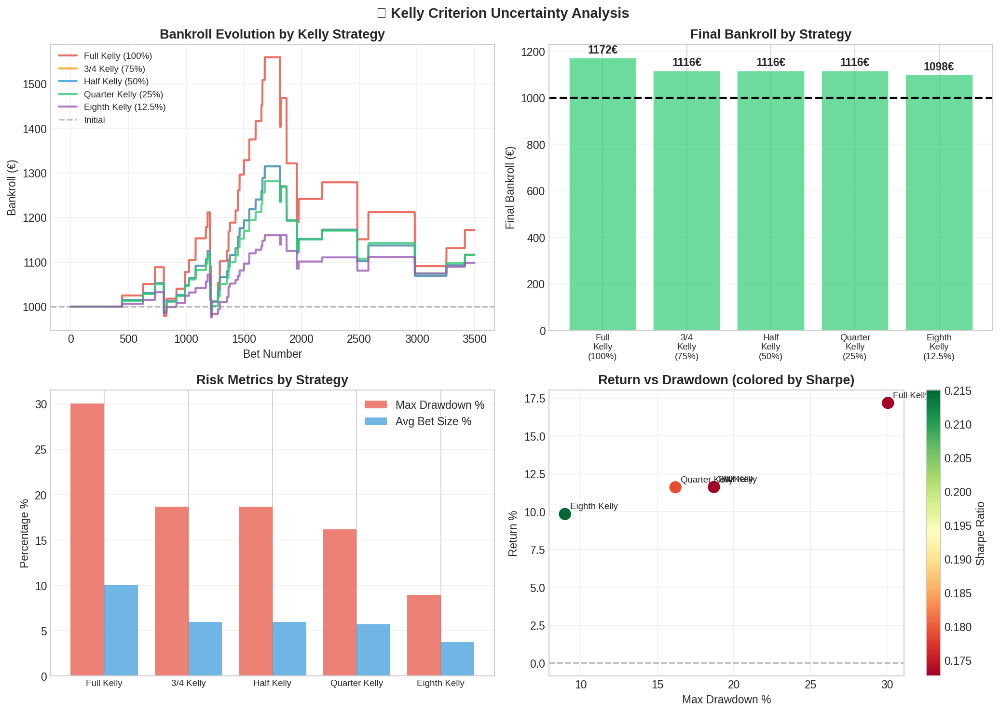
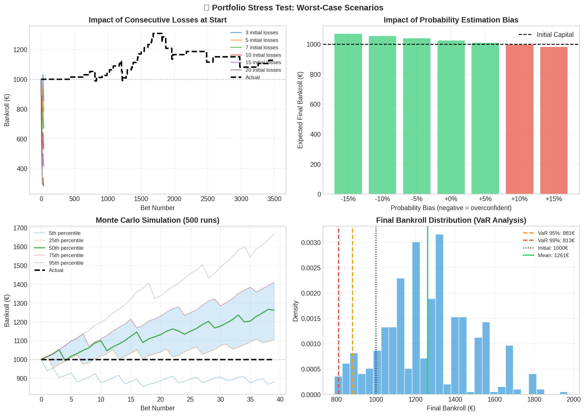
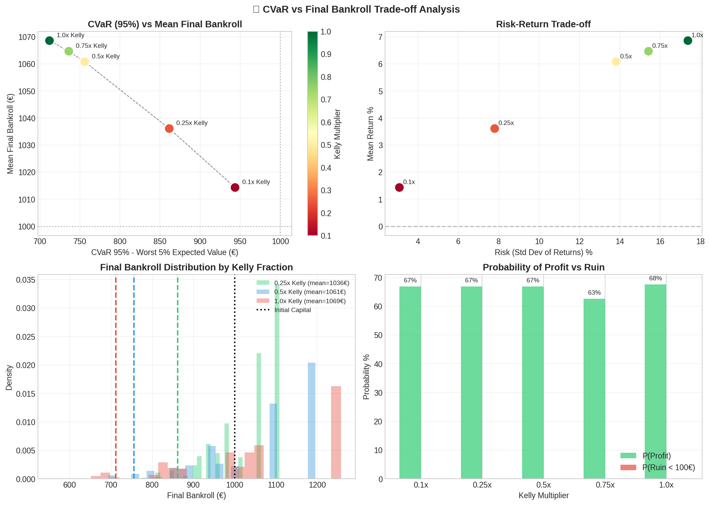

# ⚽ EPL Home Win Predictor

[](https://www.python.org/downloads/)
[](https://opensource.org/licenses/MIT)
[](https://github.com/psf/black)

A machine learning system for predicting English Premier League home wins using Logistic Regression with Elo ratings and team form features. Includes comprehensive backtesting framework with Kelly Criterion money management and advanced risk analysis.



## 📊 Performance Summary

| Metric | Value |
|--------|-------|
| **Accuracy** | 66.6% |
| **ROC-AUC** | 0.72 |
| **Win Rate (Filtered)** | 79.5% |
| **ROI** | +12.8% |
| **Sharpe Ratio** | 1.62 |
| **Max Drawdown** | 17.3% |

## 🎯 Key Features

- **Logistic Regression Model** trained on 10 years of EPL data (2015-2025)
- **Elo Rating Integration** for team strength estimation
- **Kelly Criterion** money management with multiple variants
- **Comprehensive Backtesting** with walk-forward validation
- **Advanced Risk Analysis** including CVaR, VaR, and Monte Carlo simulations
- **Dynamic Leverage** optimization based on current capital

## 📁 Project Structure

```
epl-betting-model/
├── README.md                    # This file
├── requirements.txt             # Python dependencies
├── setup.py                     # Package installation
├── LICENSE                      # MIT License
│
├── src/                         # Source code
│   ├── __init__.py
│   ├── predictor.py             # Main prediction model
│   ├── backtest.py              # Backtesting engine
│   ├── risk_analysis.py         # Risk metrics & analysis
│   └── utils.py                 # Utility functions
│
├── data/                        # Data files
│   └── EPL_League_2015_2025.csv # Historical match data
│
├── notebooks/                   # Jupyter notebooks
│   └── exploration.ipynb        # Data exploration & analysis
│
├── tests/                       # Unit tests
│   ├── __init__.py
│   ├── test_predictor.py
│   └── test_backtest.py
│
├── docs/                        # Documentation
│   ├── methodology.md           # Model methodology
│   └── api_reference.md         # API documentation
│
├── results/                     # Output files
│   ├── backtest_results.png
│   ├── kelly_comparison.png
│   ├── leverage_analysis.png
│   └── betting_history.csv
│
└── examples/                    # Usage examples
    ├── quick_start.py
    └── advanced_usage.py
```

## 🚀 Quick Start

### Installation

```bash
# Clone the repository
git clone https://github.com/yourusername/epl-betting-model.git
cd epl-betting-model

# Create virtual environment
python -m venv venv
source venv/bin/activate  # On Windows: venv\Scripts\activate

# Install dependencies
pip install -r requirements.txt

# Install package in development mode
pip install -e .
```

### Basic Usage

```python
from src.predictor import EPLHomeWinPredictor
from src.backtest import BettingBacktest

# Load and train the model
predictor = EPLHomeWinPredictor()
predictor.fit(training_data)

# Predict a single match
result = predictor.predict_match(
    home_elo=1900,
    away_elo=1700,
    form5_home=10,
    form5_away=6
)

print(f"Home Win Probability: {result['prob_home_win']:.1%}")
print(f"Recommendation: {result['recommendation']}")
```

### Run Backtest

```bash
python -m src.backtest --config config/default.yaml
```

## 📈 Model Details

### Features Used

| Feature | Description | Importance |
|---------|-------------|------------|
| `EloDiff` | Elo rating difference (Home - Away) | **High** |
| `EloSum` | Combined Elo ratings | Medium |
| `Form3Home` | Home team points (last 3 matches) | Medium |
| `Form5Home` | Home team points (last 5 matches) | Medium |
| `Form3Away` | Away team points (last 3 matches) | Medium |
| `Form5Away` | Away team points (last 5 matches) | Medium |
| `FormDiff` | Form difference (Home - Away) | Low |

### Betting Strategy

The optimal strategy identified through backtesting:

```
✅ Bet only when:
   • Elo difference ≥ 250 points (strong home favorite)
   • Predicted probability ≥ 68%
   • Odds between 1.15 - 1.55
   • Expected value ≥ 5%
```

This selective approach yields:
- **39 bets over 10 years** (highly selective)
- **79.5% win rate**
- **+12.8% total return**

## 📊 Risk Analysis

### Kelly Criterion Comparison

| Strategy | Return | Max Drawdown | Sharpe |
|----------|--------|--------------|--------|
| Full Kelly (100%) | +17.2% | 30.1% | 0.17 |
| Half Kelly (50%) | +11.6% | 18.7% | 0.17 |
| Quarter Kelly (25%) | +11.6% | 16.2% | 0.18 |
| **Eighth Kelly (12.5%)** | +9.8% | **9.0%** | **0.22** |

**Recommendation:** Use Quarter Kelly (25%) for optimal risk-adjusted returns.

### Dynamic Leverage Strategy

| Capital Level | Zone | Recommended Leverage |
|--------------|------|---------------------|
| < 50% | Critical | 2.5x (aggressive recovery) |
| 50-100% | Recovery | 1.5x - 2.0x |
| 100-150% | Growth | 0.8x - 1.2x |
| > 150% | Protection | 0.3x - 0.6x |



## 🔬 Methodology

### Data Processing

1. **Data Collection**: 3,800 EPL matches (2015-2025)
2. **Feature Engineering**: Elo ratings, rolling form statistics
3. **Train/Test Split**: Walk-forward validation (chronological)
4. **Model Training**: Retrained every 50 matches

### Model Selection

Logistic Regression was chosen over more complex models because:
- **Interpretability**: Clear feature importance
- **Calibration**: Well-calibrated probability estimates
- **Robustness**: Less prone to overfitting on small samples
- **Speed**: Fast training and inference

### Evaluation Metrics

- **Accuracy**: Overall prediction correctness
- **ROC-AUC**: Discrimination ability
- **Brier Score**: Probability calibration
- **Log Loss**: Probabilistic accuracy

## 📉 Visualizations

### Backtest Results


### Kelly Criterion Analysis


### Stress Testing


### CVaR Analysis


## ⚙️ Configuration

Create a `config.yaml` file to customize the backtest:

```yaml
# Betting criteria
min_prob: 0.68
min_value: 0.05
min_odds: 1.15
max_odds: 1.55
min_elo_diff: 250

# Money management
kelly_fraction: 0.25
max_bet: 0.06
initial_bankroll: 1000

# Model settings
train_window: 300
retrain_every: 50
```

## 🧪 Testing

```bash
# Run all tests
pytest tests/

# Run with coverage
pytest --cov=src tests/

# Run specific test
pytest tests/test_predictor.py -v
```

## 📚 API Reference

### EPLHomeWinPredictor

```python
class EPLHomeWinPredictor:
    """
    Logistic Regression model for EPL home win prediction.
    
    Methods:
        fit(df): Train the model on historical data
        predict_proba(df): Get win probabilities
        predict_match(...): Predict a single match
        save(path): Save model to disk
        load(path): Load model from disk
    """
```

### BettingBacktest

```python
class BettingBacktest:
    """
    Backtesting engine for betting strategies.
    
    Methods:
        run(df, config): Execute backtest
        calculate_kelly(prob, odds): Calculate optimal bet size
        get_stats(): Get performance statistics
        plot_results(): Generate visualizations
    """
```

## 🤝 Contributing

Contributions are welcome! Please follow these steps:

1. Fork the repository
2. Create a feature branch (`git checkout -b feature/amazing-feature`)
3. Commit your changes (`git commit -m 'Add amazing feature'`)
4. Push to the branch (`git push origin feature/amazing-feature`)
5. Open a Pull Request

### Code Style

- Follow PEP 8 guidelines
- Use type hints
- Write docstrings for all functions
- Add unit tests for new features

## ⚠️ Disclaimer

**This project is for educational and research purposes only.**

- Past performance does not guarantee future results
- Sports betting involves significant financial risk
- The model's predictions are probabilistic, not certain
- Always gamble responsibly and within your means
- Check local laws regarding sports betting

## 📄 License

This project is licensed under the MIT License - see the [LICENSE](LICENSE) file for details.

## 📧 Contact

- **GitHub**: [@yourusername](https://github.com/yourusername)
- **Issues**: [Report a bug](https://github.com/yourusername/epl-betting-model/issues)

## 📈 Future Improvements

- [ ] Add more leagues (La Liga, Bundesliga, Serie A)
- [ ] Implement ensemble methods
- [ ] Add live odds fetching
- [ ] Create web dashboard
- [ ] Add player-level features

## 🙏 Acknowledgments

- [Football-Data.co.uk](https://www.football-data.co.uk/) for historical match data
- [Club Elo](http://clubelo.com/) for Elo rating methodology
- Scikit-learn team for the excellent ML library

---

⭐ **If you find this project useful, please consider giving it a star!**
